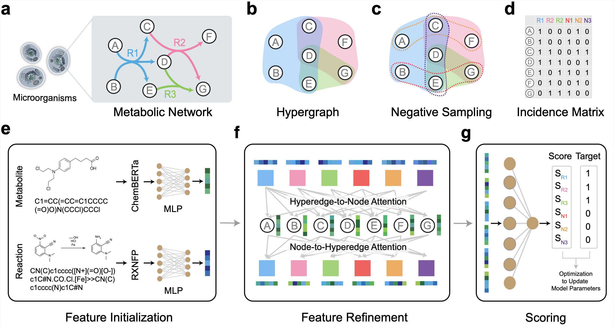

# MuSHIN: A Multi-Way SMILES-Based Hypergraph Inference Network for Metabolic Model Reconstruction

[](https://www.nature.com/articles/s42003-026-09761-1)

## Overview

Genome-scale metabolic models (GEMs) are powerful tools for studying cellular metabolism, but their accuracy is often limited by missing reactions due to incomplete knowledge and annotation gaps. To address this, we introduce **MuSHIN**, a deep hypergraph learning framework that integrates network topology with biochemical semantics to predict and recover missing reactions in GEMs. By embedding molecular structures using transformer-based models and refining features through attention-based message passing, MuSHIN effectively captures complex interactions between metabolites and reactions. This approach enables robust and scalable GEM reconstruction, significantly improving predictive performance across both internal and external validation benchmarks.

---



---

## Usage

Clone the repository:

```bash
git clone git@github.com:cyixiao/MuSHIN.git
cd MuSHIN
```

---

## Components

### [Internal Validation](src/internal/README.md)
Evaluate MuSHIN’s ability to recover synthetically removed reactions from curated GEMs (e.g., BiGG, AGORA).

### [External Validation](src/external/readme.md)
Validate phenotype prediction on draft GEMs (e.g., fermentation-associated models from Zimmermann et al.).

---


